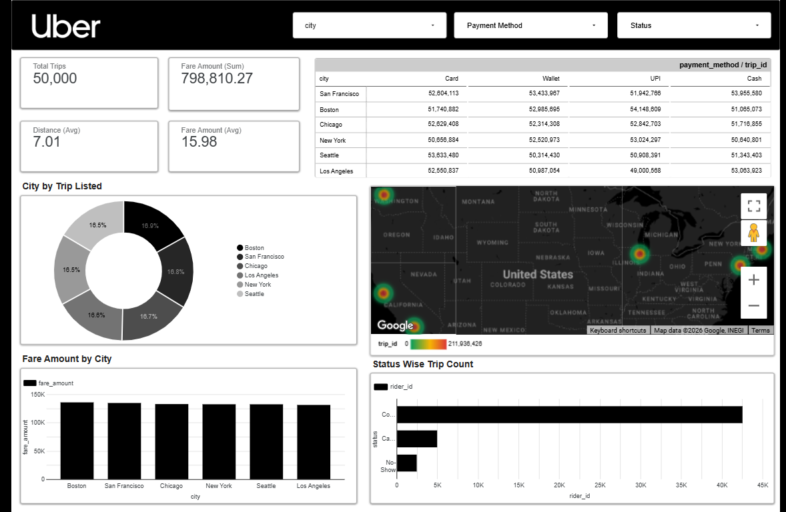

# Uber Data Analytics Dashboard

## Project Overview
In this project, I performed an end-to-end data analytics workflow on Uber data. Using Google Sheets for data preparation and Looker Studio for visualization, I designed an interactive dashboard that highlights City, trip, payment method and geographical insights in a clear and intuitive way.
Uber analytics data tracks ride activity, including trips, fares, distances, and user behavior.It helps analyze demand patterns across cities and peak booking hours.The data provides insights into payment methods like card, UPI, wallet, and cash usage.It evaluates operational efficiency through trip status such as completed, cancelled, and no-shows.These insights support better decision-making, pricing strategies, and service optimization.

## File Details
- **Filename:** [`Uber Dataset.xlsx`](https://docs.google.com/spreadsheets/d/1M6mwaW4bGIHo6-_Gg0ECvCUVnFchvEwvrQ7cpSueqgE/edit?gid=528600904#gid=528600904)
- **Total Records:** `50000`
- **Primary Keys:** `City`,`Payment Method`,`Status`
- **Source of Data:** [`uber_trips_dataset_50k (1)`](https://www.kaggle.com/datasets/ruchikakumbhar/uber-dataset)

## Data Dictionary
| Column Name | Description | Data Type |
| :--- | :--- | :--- |
| **trip_id** | Unique identifier assigned to each uber trip in the dataset. | Integer |
| **driver_id** | Unique identifier assigned the driver who completed or accepted the ride in the dataset. | Integer |
| **rider_id** | Unique identifier assigned to the passenger who booked the trip | Integer |
| **city** | Indicates the city where uber trip took place. |String |
| **pickup_lat** | Latitude coordinates of the trip's pickup location. | Float |
| **pickup_long** | Longitude coordinates of the trip's pickup location. | Float |
| **drop_lat** | Latitude coordinates of the trip's drop location. | Float |
| **drop_long** | Longitude coordinates of the trip's pickup location. | Float |
| **distance_km** | Total travel distance of thr ride mesured in kilometers. | Float |
| **fare_amount** | Total fare charged to the ride for that trip. | Integer |
| **status** | Final trip outcome such as Completed,Cancelled or No-Show. | String |
| **payment method** | Mode of payment used by rider. | String |
| **pickup_date** | calender date on which trip was started. | date |
| **Pickup_month** | Month exactracted from pickup_date for monthly analysis. | text |
| **Pickup _day** | Day of the week on which ther rider was pickedup. | text |
| **pickup_time** | Exact time at which the uber trip started from the pickup location. | time |
| **drop_date** | Calender date on which the rider was droped at the location. | date |
| **drop_month** | Month exactracted from drop_date for monthly analysis. | text |
| **drop day** | Day of the week on which the trip was drop at the location. | text |
| **drop_time** | Exact time at which the uber trip was completed at the pickup location. | time |

## Key Insights & Statistics
-**Display core metrics** like Total Trips, Total Revenue, Avg Fare, Avg Distance for quick overview.

-**Shows percentage distribution** of trips across cities to compare demand.

-**Compares revenue contribution** from each city.

-**Provides detailed breakdown** of Card, Wallet, UPI, and Cash usage.

-**Visualizes trip** density and high-demand locations across regions.

-**Displays counts** of Completed, Cancelled, and No-show trips.

**Allows dynamic analysis** by City, Payment Method, and Status.

## Future Scope
Use historical trip data to forecast demand, peak hours, and surge pricing.

Add live trip tracking and real-time Key Performance Indicators for instant decision-making.

Build models to reduce cancellations through alerts and incentives.

Enhance analysis with surge pricing trends and revenue optimization strategies.

Introduce metrics like driver ratings, acceptance rate, and efficiency scoring.

Include weather, traffic, and event data to improve demand prediction.

## Dashboard Image

## Data Cleaning & Preparation
Removed duplicate values

Handled missing or incomplete values

Verified dates and time formats

Validated calculated fields such as total trips,fare amount and distance in km.

Structured categorical fields for better filtering in dashboards.

